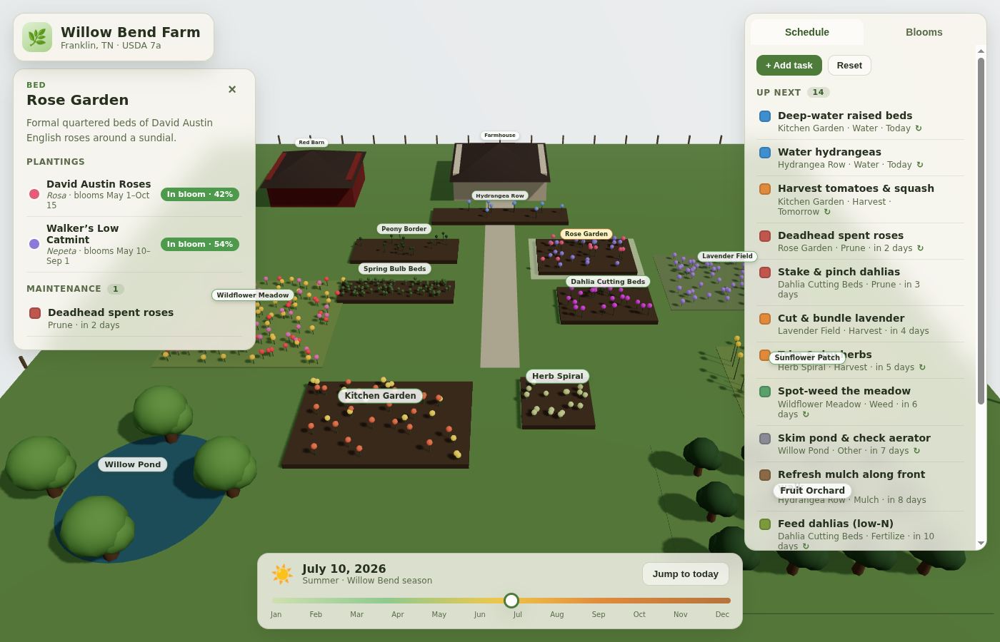

# Willow Bend Farm — 3D Virtual Map

An immersive, interactive 3D map of a farm in **Franklin, TN** (USDA zone 7a),
with a living **maintenance schedule** and **bloom calendar**. Built with React,
Vite, and Three.js (via [react-three-fiber](https://github.com/pmndrs/react-three-fiber)).



## What it does

- **Explore in 3D** — orbit, pan, and zoom around the property: farmhouse, red
  barn, raised garden beds, lavender field, wildflower meadow, sunflower patch,
  fruit orchard, herb spiral, kitchen garden, and a willow-ringed pond.
- **Watch the seasons turn** — drag the timeline at the bottom to scrub through
  the year. Flowers open into their real bloom colors inside their bloom
  windows and fade to foliage green otherwise; the orchard blossoms in spring,
  the dahlias and sunflowers light up in late summer.
- **Click any zone** to see its plantings, live bloom status, and the
  maintenance tasks scoped to it.
- **Keep a schedule** — add, check off, and delete maintenance tasks (watering,
  pruning, harvesting, fertilizing, mulching, weeding, planting). Overdue and
  recurring chores are flagged. Everything persists in your browser via
  `localStorage` (no backend required).
- **Bloom calendar** — a sorted list of what's flowering now and what's coming
  up next; click a bloom to jump the map to that zone.

## Run it

```bash
npm install
npm run dev      # http://localhost:5173
```

Production build:

```bash
npm run build    # outputs to dist/
npm run preview
```

## Project layout

```
src/
  data/farm.js            The farm model: zones, plantings (bloom windows),
                          and the seeded maintenance schedule. Edit this to
                          reshape the farm.
  lib/
    bloom.js              Bloom-window math (day-of-year ring, status, calendar)
    dates.js              Calendar helpers + the "view date" the app scrubs
    store.js              localStorage persistence for the task list
  components/
    FarmScene.jsx         Canvas, lighting, sky, orbit controls
    scene/                Ground, Zone (dispatches by kind), Flowers, Tree
    ui/                   Sidebar (Schedule + Blooms), ZoneDetail, DateControl
  App.jsx                 Layout and state wiring
```

## Data model

Each **zone** has a `kind` (`bed`, `field`, `orchard`, `water`, `structure`), a
footprint on the ground plane, and a list of **plantings**. A planting carries a
recurring bloom window as `MM-DD` strings (`bloomStart` / `bloomEnd`) plus its
bloom and foliage colors, count, and height — that's what the scene renders and
what the bloom calendar reasons about.

**Tasks** are dated (`YYYY-MM-DD`), categorized, and optionally recurring. They
seed from `data/farm.js` on first load, then live in `localStorage` so your
edits stick.

To adapt this to a different property, edit `src/data/farm.js` — positions are
in scene units on a centered ground plane (`+x` east, `+z` south).
